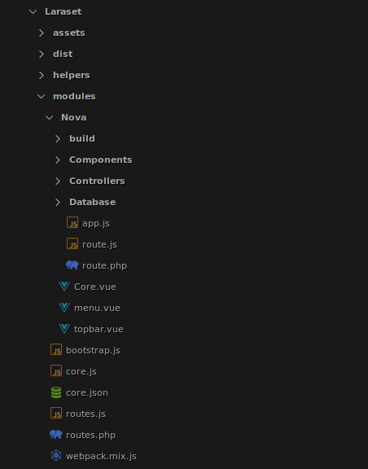

# The Basics

**Laraset** is a module manager using Laravel artisan CLI. Tt's targets all preset Laravel uses. it has the ability to Create Delete Units that wrap all [laravel](https://laravel.com) features & preset used in one folder that can exported or event imported from project to another. for now we still in dev phase and supporting only [vuejs](https://vuejs.org) 2.*
:::warning Export/Import
This feature not yet available. we are planing to integrat it in future.
:::
## To use Laraset

By default, Laraset in not installed to use it you should run `laraset:install` command :

```bash
php artisan laraset:install
```
Then `Laraset` Folder will be generated within `app` Folder : 

 <br>

:::tip Module Location

By default, all units will be stored  within the  `app/Laraset/units` directory.
:::
