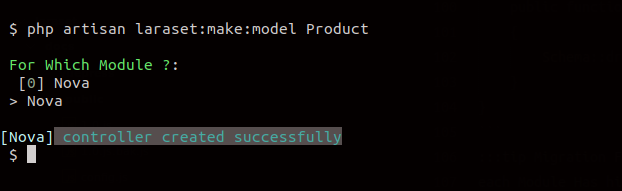
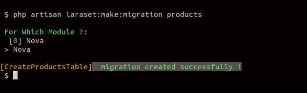

# Commands 
[[toc]]

All Laraset Command listed :
| Command | Description |
|---                                        |---|
| `laraset:install`                         | Install laraset |
| [`#laraset:unit`](#make-unit)             | Create unit |
| [`#laraset:unit -d`](#delete-unit)        | Delete unit |
| [`#laraset:controller`](#make-controller) | Create controller for choosen unit |
| [`#laraset:model`](#make-model)           | Create model for choosen unit |
| `laraset:migration`                       | Create migration for choosen unit |
| `laraset:migrate`                         | Have the same behaviour as `php artisan migrate` but with units migrations |
| `laraset:units`                           | List all created and existant units |

 


#make-migration

## Make unit
```bash
php artisan laraset:unit [name]
```


## Delete unit 
This command allow you to delete `Laraset` unit with double check
- select unit
- `yes` to confirm delete action
```
php artisan laraset:delete
```

:::danger 
This Action is irreversable, you can't get back deleted units
:::

## Make Controller
```bash
php artisan laraset:controller [name]
```


```php
namespace App\Laraset\units\Nova\Controllers;

use App\Http\Controllers\Controller;
use Illuminate\Http\Request;

class ProductController extends Controller
{
    /**
     * Get the fields displayed by the resource.
     *
     * @param  \Illuminate\Http\Request  $request
     * @return mixed
     */
    public function index(Request $request)
    {
        //
    }
}
```

## Make Model
```bash
php artisan laraset:model [name]
```


```php
namespace App\Laraset\units\Nova\Database\Models;

use Illuminate\Database\Eloquent\Model;

class Product extends Model
{
    //
}
```
:::tip Model File Location
each unit Has his own Model files within `Laraset/Nova/Database/Models` directory
:::
## Make Migration
```bash
php artisan laraset:migration [name]
```


```php
use Illuminate\Support\Facades\Schema;
use Illuminate\Database\Schema\Blueprint;
use Illuminate\Database\Migrations\Migration;

class CreateProductsTable extends Migration
{
    /**
     * Run the migrations.
     *
     * @return void
     */
    public function up()
    {
        Schema::create('products', function (Blueprint $table) {
            $table->increments('id');
            $table->string('name');
            $table->rememberToken();
            $table->timestamps();
        });
    }
    /**
     * Reverse the migrations.
     *
     * @return void
     */
    public function down()
    {
        Schema::dropIfExists('products');
    }
}
```
:::tip Migration File Location
each unit Has his own Migration files within `Laraset/Nova/Database/Migrations` directory
:::
